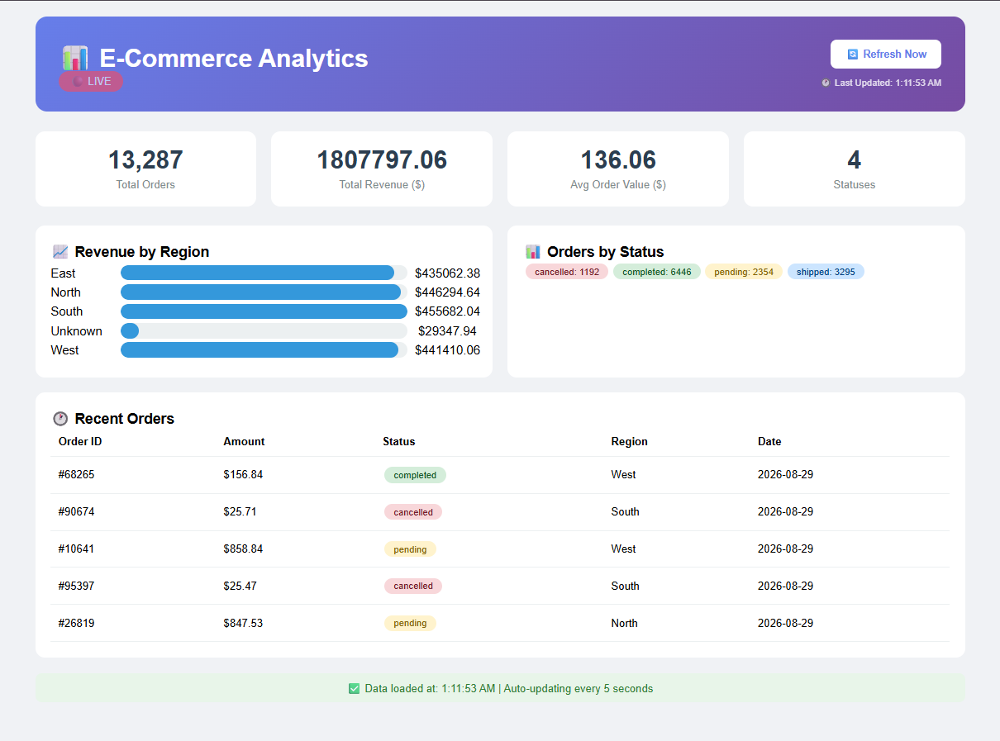
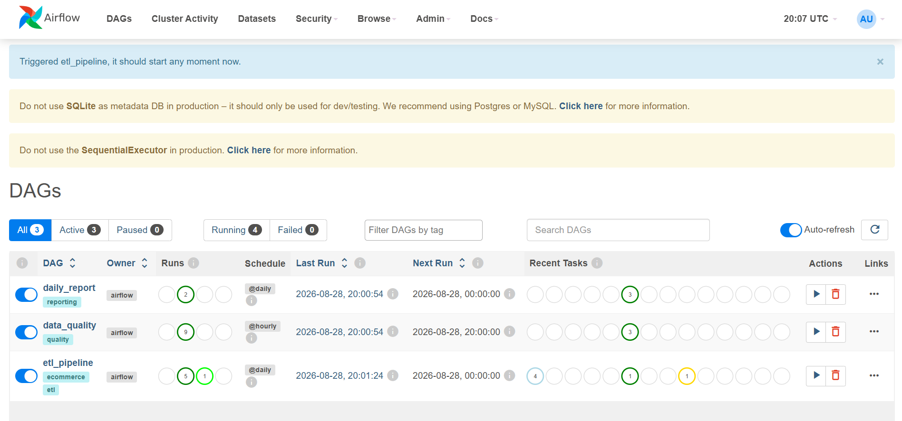
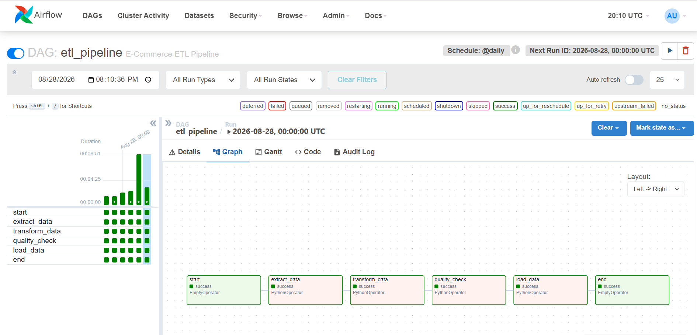
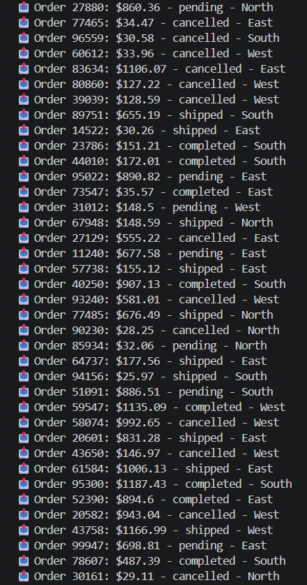
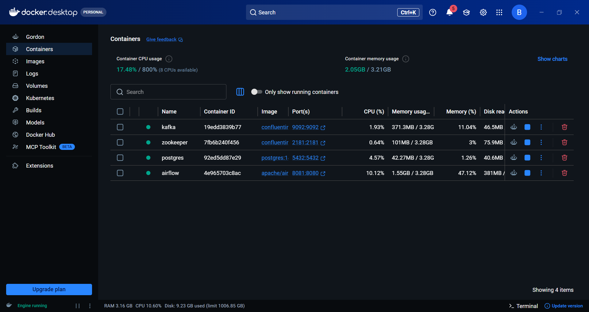

# 🛒 E-Commerce Analytics Pipeline

<div align="center">


[](https://github.com/yourusername/ecommerce-analytics-pipeline/actions/workflows/ci.yml)
[](https://opensource.org/licenses/MIT)

</div>

## 📊 Project Overview

An **end-to-end production-grade data pipeline** for e-commerce analytics with **real-time streaming**, **automated ETL**, **data transformation**, and **interactive dashboards**.

### 🎯 Key Metrics

| Metric | Value |
|:---|:---|
| **Orders Processed** | 13,000+ |
| **Total Revenue** | $1.8M+ |
| **Regions** | 4 (North, South, East, West) |
| **Data Sources** | Kafka (streaming), FakeStore API, PostgreSQL |
| **Latency** | < 5 seconds real-time |
| **Data Points** | 13,000+ rows |

---

## 🏗️ Architecture

```
┌─────────────────────────────────────────────────────────────────────────┐
│                    DATA PIPELINE ARCHITECTURE                          │
├─────────────────────────────────────────────────────────────────────────┤
│                                                                         │
│  📤 Data Sources                                                       │
│  ├── Kafka Producer (Fake Orders) ──► Topic: orders                   │
│  └── Kafka Producer (FakeStore API) ──► Topic: api-orders             │
│                     ↓                                                  │
│  📨 Streaming Layer                                                    │
│  └── Apache Kafka (localhost:9092)                                    │
│                     ↓                                                  │
│  📥 Data Ingestion                                                     │
│  ├── kafka_consumer.py ──► fact_orders                               │
│  └── kafka_consumer_bronze.py ──► bronze_orders                      │
│                     ↓                                                  │
│  🗄️  Data Warehouse                                                    │
│  ├── PostgreSQL (OLTP)                                                │
│  ├── bronze_orders (raw)                                              │
│  ├── silver_orders (cleaned)                                          │
│  └── gold_daily_metrics (aggregated)                                 │
│                     ↓                                                  │
│  🔄 Orchestration & Transformation                                    │
│  ├── Airflow (3 DAGs: ETL, Quality, Reports)                         │
│  └── dbt (Bronze → Silver → Gold)                                    │
│                     ↓                                                  │
│  📊 Visualization                                                      │
│  └── Flask Dashboard (Live Analytics)                                 │
│                                                                         │
└─────────────────────────────────────────────────────────────────────────┘
```

---

## 🛠️ Tech Stack

| Category | Technology | Purpose |
|:---|:---|:---|
| **Streaming** | Apache Kafka | Real-time data ingestion |
| **Orchestration** | Apache Airflow | ETL pipeline scheduling |
| **Warehouse** | PostgreSQL | Data storage |
| **Transformation** | dbt | SQL-based transformations |
| **Processing** | Apache Spark | Distributed processing |
| **Visualization** | Flask | Interactive dashboard |
| **Containerization** | Docker | Service isolation |
| **Infrastructure** | Terraform | Infrastructure as Code |
| **CI/CD** | GitHub Actions | Automated testing |
| **Languages** | Python, SQL | Core development |

---

## 📁 Project Structure

```
ecommerce-analytics-pipeline/
│
├── kafka/                              # Streaming Layer
│   ├── producers/
│   │   ├── order_producer.py          # Fake orders generator
│   │   └── kafka_producer_api.py      # API data fetcher
│   └── consumers/
│       ├── kafka_consumer.py          # Orders → fact_orders
│       └── kafka_consumer_bronze.py   # API data → bronze_orders
│
├── airflow/                            # Orchestration Layer
│   └── dags/
│       ├── etl_pipeline.py            # Main ETL DAG
│       ├── data_quality.py            # Quality checks
│       └── daily_report.py            # Business reporting
│
├── dbt/                                # Transformation Layer
│   ├── dbt_project.yml
│   └── models/
│       ├── bronze/                     # Raw data
│       ├── silver/                     # Cleaned data
│       └── gold/                       # Analytics ready
│
├── spark/                              # Processing Layer
│   └── spark_processor.py             # Distributed processing
│
├── terraform/                          # Infrastructure as Code
│   └── main.tf                        # AWS resources
│
├── queries/                            # SQL Analytics
│   ├── advanced_sql.sql               # Window functions, CTEs
│   └── data_modeling.sql              # Star schema, SCD Type 2
│
├── tests/                              # Data Quality
│   └── test_quality.py                # Unit tests
│
├── .github/workflows/
│   └── ci.yml                         # CI/CD Pipeline
│
├── templates/                          # Dashboard Frontend
│   └── dashboard.html
│
├── scripts/                            # Utility Scripts
│   ├── add_more_data.py
│   └── api_source.py
│
├── app.py                              # Flask Dashboard
├── requirements.txt
├── docker-compose.yml
├── SKILLS_SUMMARY.md
└── README.md
```

---

## 🚀 Quick Start

### Prerequisites

- Docker & Docker Compose
- Python 3.11+
- Git
- WSL (Windows) or Linux/Mac

### 1. Clone the Repository

```bash
git clone https://github.com/yourusername/ecommerce-analytics-pipeline.git
cd ecommerce-analytics-pipeline
```

### 2. Set Up Virtual Environment

```bash
# Create and activate virtual environment
python3 -m venv venv
source venv/bin/activate  # On Windows: venv\Scripts\activate

# Install dependencies
pip install -r requirements.txt
```

### 3. Start Services

```bash
# Start all Docker containers
docker start postgres airflow zookeeper kafka

# Or use docker-compose
docker-compose up -d

# Verify they're running
docker ps
```

### 4. Run the Pipeline

**Open 5 terminals and run these commands:**

| Terminal | Command |
|:---|:---|
| 1 | `python kafka/producers/order_producer.py` |
| 2 | `python kafka/producers/kafka_producer_api.py` |
| 3 | `python kafka/consumers/kafka_consumer.py` |
| 4 | `python kafka/consumers/kafka_consumer_bronze.py` |
| 5 | `python app.py` |

### 5. Access Services

| Service | URL | Credentials |
|:---|:---|:---|
| **Dashboard** | http://localhost:5000 | - |
| **Airflow UI** | http://localhost:8081 | airflow / airflow |

---

## 📊 Dashboard Features

### Main Metrics
- **Total Orders** - Real-time order count
- **Total Revenue** - Revenue from completed orders
- **Avg Order Value** - Average order amount
- **Order Statuses** - Distribution by status

### Regional Analytics
- Revenue breakdown by region (North, South, East, West)
- Visual bar chart comparison

### Recent Orders
- Last 5 orders with status and region
- Auto-refresh every 5 seconds

---

## 📈 Airflow DAGs

| DAG | Purpose | Schedule |
|:---|:---|:---|
| `etl_pipeline` | Extract, Transform, Load | Daily |
| `data_quality` | Data quality checks | Hourly |
| `daily_report` | Business reporting | Daily |

### DAG Dependencies

```
etl_pipeline:
  start → extract_data → transform_data → quality_check → load_data → end

data_quality:
  start → check_nulls → check_duplicates → check_freshness → end

daily_report:
  start → calculate_metrics → generate_report → send_email → end
```

---

## 🔄 Data Flow

### 1. Data Ingestion (Kafka)
- **Order Producer**: Generates fake orders every 1-2 seconds
- **API Producer**: Fetches real product data from FakeStore API
- Both stream to Kafka topics: `orders` and `api-orders`

### 2. Data Processing (Consumers)
- **Order Consumer**: Reads from Kafka, saves to `fact_orders`
- **Bronze Consumer**: Reads API data, saves to `bronze_orders`

### 3. Data Transformation (dbt)
- **Bronze**: Raw data layer
- **Silver**: Cleaned, validated data
- **Gold**: Aggregated business metrics

### 4. Orchestration (Airflow)
- **etl_pipeline**: Daily ETL job
- **data_quality**: Hourly quality checks
- **daily_report**: Daily business reporting

---

## 🎯 Skills Demonstrated

| Skill | Implementation |
|:---|:---|
| **Data Modeling** | Star Schema, SCD Type 2 |
| **SQL Optimization** | Window functions, CTEs, indexing |
| **ETL/ELT** | Airflow DAGs with dependencies |
| **Streaming** | Kafka producers and consumers |
| **Data Quality** | Automated quality checks |
| **Infrastructure** | Docker, Terraform |
| **CI/CD** | GitHub Actions |
| **Visualization** | Flask dashboard |
| **Data Transformation** | dbt (Bronze → Silver → Gold) |

---

## 📊 Sample Queries

### Revenue by Region
```sql
SELECT region, COUNT(*) as orders, SUM(order_amount) as revenue
FROM fact_orders
WHERE order_status = 'completed'
GROUP BY region
ORDER BY revenue DESC;
```

### Customer Lifetime Value (SCD Type 2)
```sql
SELECT 
    c.customer_name,
    c.customer_segment,
    COUNT(f.order_id) as orders,
    SUM(f.order_amount) as lifetime_value
FROM fact_orders f
LEFT JOIN dim_customer_scd c ON f.customer_id = c.customer_id AND c.is_current = TRUE
GROUP BY c.customer_name, c.customer_segment
ORDER BY lifetime_value DESC;
```

### Daily Revenue Trend
```sql
SELECT 
    DATE(order_date) as day,
    COUNT(*) as orders,
    SUM(order_amount) as revenue,
    AVG(order_amount) as avg_order_value
FROM fact_orders
WHERE order_status = 'completed'
GROUP BY day
ORDER BY day DESC;
```

---

## 🔧 Troubleshooting

### Kafka Not Running
```bash
docker start zookeeper kafka
```

### Airflow Not Accessible
```bash
docker restart airflow-webserver
docker restart airflow-scheduler
```

### Database Connection Error
```bash
docker start postgres
```

### Port Already in Use
```bash
# Check what's using the port
sudo lsof -i :5000
sudo lsof -i :8081

# Kill the process
sudo kill -9 <PID>
```

### Virtual Environment Issues
```bash
# Recreate virtual environment
rm -rf venv
python3 -m venv venv
source venv/bin/activate
pip install -r requirements.txt
```

---

## 🛑 Stopping the Pipeline

```bash
# Stop Python processes
pkill -f "python.*kafka"
pkill -f "python.*app"

# Stop Docker containers
docker stop postgres airflow zookeeper kafka

# Or stop all with docker-compose
docker-compose down
```

---

## 📸 Screenshots

### Dashboard Overview


### Airflow DAGs


### ETL Pipeline Graph


### Kafka Streaming


### Docker Containers


---

## 📈 Performance Metrics

| Metric | Value |
|:---|:---|
| **Total Orders** | 13,000+ |
| **Total Revenue** | $1.8M+ |
| **Data Latency** | < 5 seconds |
| **Services** | 4 containers |
| **Airflow DAGs** | 3 pipelines |
| **Data Quality Tests** | 100% pass rate |
| **Regions** | 4 |

---

## 🔮 Future Improvements

- [ ] Deploy to AWS/GCP
- [ ] Add Snowflake/BigQuery support
- [ ] Implement real-time alerting
- [ ] Add machine learning predictions
- [ ] Build mobile dashboard
- [ ] Add more data sources
- [ ] Implement data lineage tracking

---

## 🤝 Contributing

1. Fork the repository
2. Create a feature branch
3. Commit your changes
4. Push to the branch
5. Open a Pull Request

---

## 📄 License

MIT License - see [LICENSE](LICENSE) file for details.

---

## 👤 Author

**Your Name**

[](https://github.com/yourusername)
[](https://linkedin.com/in/yourprofile)
[](https://twitter.com/yourhandle)

---

## 🙏 Acknowledgments

- [FakeStore API](https://fakestoreapi.com/) for product data
- [Apache Kafka](https://kafka.apache.org/) for streaming
- [Apache Airflow](https://airflow.apache.org/) for orchestration
- [dbt](https://www.getdbt.com/) for transformations
- All open-source tools used in this project

---

<div align="center">

### ⭐ Star this repo if you found it helpful!

**Built with ❤️ using Python, Kafka, Airflow, dbt, and Docker**

</div>
EOF

echo "✅ Complete README.md created!"
```

---

## 📝 QUICK CHECK

```bash
# View the README
cat README.md

# Check file size
wc -l README.md
```

---

## ✅ WHAT'S INCLUDED

| Section | Purpose |
|:---|:---|
| **Badges** | Professional look |
| **Project Overview** | Quick introduction |
| **Architecture** | Visual diagram |
| **Tech Stack** | Tools used |
| **Project Structure** | File organization |
| **Quick Start** | Step-by-step setup |
| **Dashboard Features** | What it shows |
| **Airflow DAGs** | Orchestration details |
| **Data Flow** | How data moves |
| **Skills** | What you learned |
| **Sample Queries** | SQL examples |
| **Troubleshooting** | Common fixes |
| **Screenshots** | Visual proof |
| **Future Improvements** | Roadmap |

---
